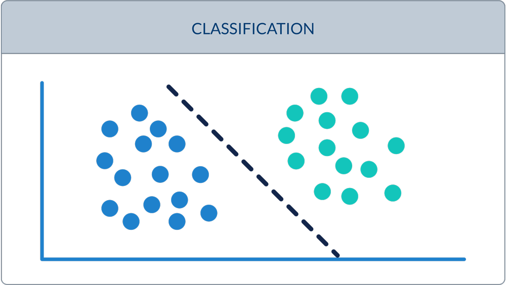
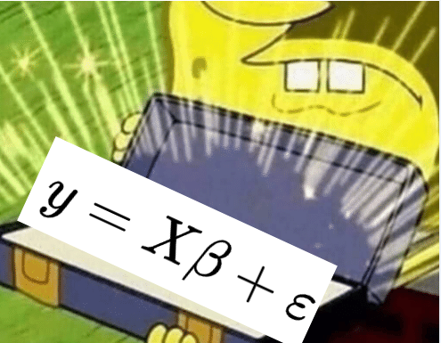
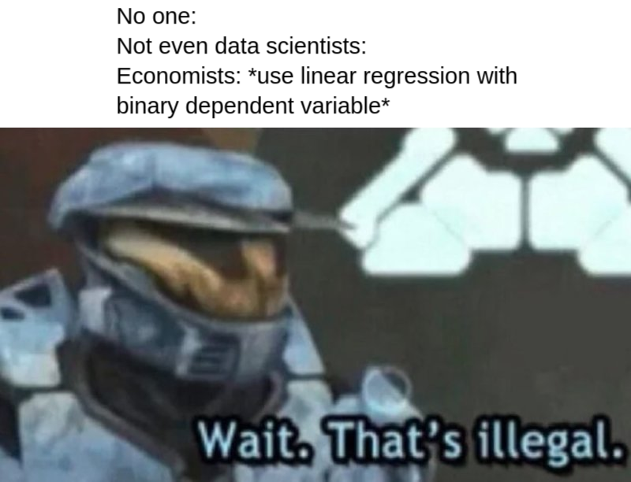
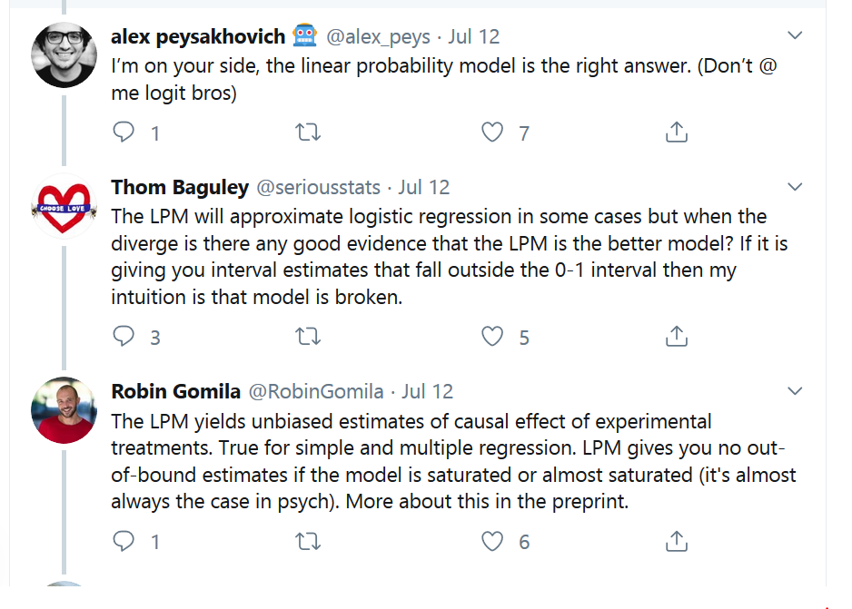
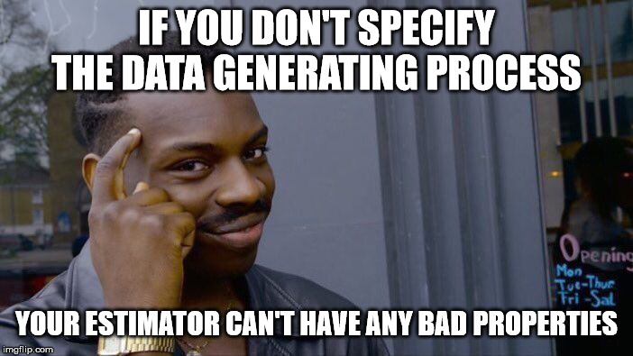
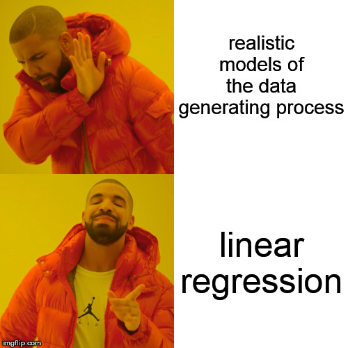
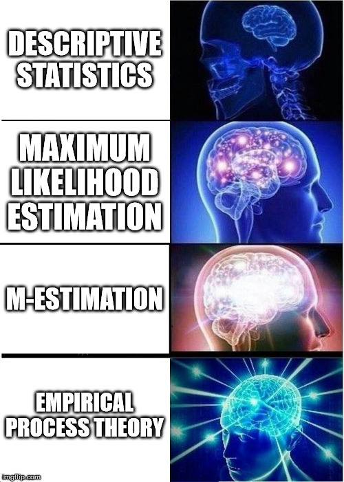

```{r setup, include = FALSE}
knitr::opts_chunk$set(
  echo = FALSE,
  message = FALSE,
  warning = FALSE,
  fig.align = "center"
)
```

# Economists will be the death of us all

## 

```{r echo = FALSE, out.width = "\\textwidth"}

```

## 

```{r echo = FALSE, out.width = "0.8\\textwidth"}

```

##

```{r echo = FALSE, out.width = "0.8\\textwidth"}

```

## 

```{r echo = FALSE, out.width = "0.8\\textwidth"}

```

# "The Linear Probability Model"

## Setup

Data: Suppose we have outcomes $Y \in \{0, 1\}$ and fixed covariates $X$

Estimand: $\mathbb{E}(Y|X)$

Estimator: $\hat \beta_\text{OLS} = (X'X)^{-1} X'y$

Do these estimates mean anything?

## People love to argue about this

```{r echo = FALSE, out.width = "0.8\\textwidth"}

```

## 

```{r echo = FALSE, out.width = "0.8\\textwidth"}

```

## Achieving clarity and moral superiority via M-estimation

Recall that an M-estimator $\hat \theta$ is the solution to

\begin{align*}
\sum_{i=1}^n \psi(Y_i, \hat \theta) = 0
\end{align*}

for some function $\psi$. Think of $\psi$ as a score function or the derivative of a proper scoring rule.

## Consistency of M-estimators

If the true value $\theta_0$ is the unique solution to

\begin{align*}
\mathbb{E} \left( \sum_{i=1}^n \psi(Y_i, \theta_0) \right) = 0
\end{align*}

then $\hat \theta \to \theta_0$. This is a gloriously simple condition to check.

## Asymptotic normality of M-estimators

Under some regularity conditions, provided that 

\begin{align*}
A(\theta_0) = \mathbb{E} \left( - \psi' (Y_i, \theta_0) \right)
\end{align*}

and

\begin{align*}
B(\theta_0) = \mathbb{E} \left( \psi(Y_i, \theta_0) \psi(Y_i, \theta_0)^T \right)
\end{align*}

exist for all $i = 1, ..., n$, then $\hat \theta$ is also asymptotically normal with variance $A(\theta_0)^{-1} \cdot B(\theta_0) \cdot \{ A(\theta_0)^{-1} \}^T$.

## Plug in $\hat \theta$ to estimate the variance

We also have that 

\begin{align*}
A(\hat \theta)^{-1} \cdot B(\hat \theta) \cdot \{ A(\hat \theta)^{-1} \}^T
\rightarrow A(\theta_0)^{-1} \cdot B(\theta_0) \cdot \{ A(\theta_0)^{-1} \}^T
\end{align*}

so life is pretty great and we can get asymptotic estimates of uncertainty.

## OLS is an M-estimator

OLS is based on minimizing

\begin{align*}
\mathcal{L}(X, Y, \beta) = \frac 12 \Vert Y - X \beta \Vert_2^2
\end{align*}

which has a global minimizer $\beta_0$. The gradient,

\begin{align*}
\nabla \mathcal{L}(X, Y, \beta) = \left( Y - X \beta \right)' X,
\end{align*}

should be zero at $\beta_0$ under a Gaussian model. So we take $\psi = \nabla \mathcal{L}$, since $\mathbb{E} (\nabla \mathcal{L} (X, Y, \beta_0)) = 0$.

## OLS is still an M-estimator

Who cares about variance, let's just figure out when OLS is consistent. We have

\begin{align*}
\psi(Y_i, X_i, \beta) = \left( Y_i - X_i^T \beta \right)' X_i
\end{align*}

where $Y_i \in \mathbb{R}$ and $X_i, \beta \in \mathbb{R}^p$. Now, if 

\begin{align*}
\mathbb{E}_F \left[ \left( Y_i - X_i^T \beta_0 \right)' X_i \right] = 0
\end{align*}

then $\hat \beta_\text{OLS}$ is consistent for $\mathbb{E}(Y|X)$ under distribution $F$.

## Necessary and sufficient condition for consistency

OLS is consistent for $\beta_0$ if

\begin{align*}
  0 
  &= \mathbb{E}_F \left[ \left( Y - X_i^T \beta_0 \right)' X_i \right] \\
  &= \mathbb{E}_F \left[ \mathbb{E}_F \left[ \left( Y - X_i^T \beta_0 \right)' X_i \Big \vert X_i \right] \right] \\
  &= \mathbb{E}_F \left[ \mathbb{E}_F \left[ Y - X_i^T \beta_0 \Big \vert X_i \right]' X_i \right].
\end{align*}

So a necessary and sufficient condition for the consistency of OLS is that

\begin{align*}
  \mathbb{E}_F(Y | X_i) = X_i^T \beta_0.
\end{align*}

## 

```{r echo = FALSE, out.width = "0.65\\textwidth"}

```

## 

```{r echo = FALSE, out.width = "0.8\\textwidth"}

```

# Possible Data Generating Processes

## The Linear Probability Model

\begin{align*}
P(Y = 1 | X) = 
  \begin{cases}
  1 & \beta_0 + \beta_1 x_1 + ... + \beta_k x_k > 1 \\
  \beta_0 + \beta_1 x_1 + ... + \beta_k x_k & \beta_0 + \beta_1 x_1 + ... + \beta_k x_k \in [0, 1] \\
  0 & \beta_0 + \beta_1 x_1 + ... + \beta_k x_k < 0
  \end{cases}
\end{align*}

Essentially: clip $P(Y = 1 | X) = X \beta$ to $[0, 1]$ to get valid probabilities

## Logistic Regression (Binomial GLM)

\begin{align*}
P(Y = 1 | X) = \frac{1}{1 + \exp(-(\beta_0 + \beta_1 x_1 + ... + \beta_k x_k))}
\end{align*}

## All of the models at once

\begin{align*}
Y_i | X_i &\sim \mathrm{Normal}(X_i \beta, \sigma^2)
  & \text{linear regression / Gaussian GLM} \\
Y_i | X_i &\sim \mathrm{Bernoulli}(\min(1, \max(0, X_i \beta)))
  & \text{linear probability model} \\
Y_i | X_i &\sim \mathrm{Bernoulli}(\mathrm{logit}^{-1} (X_i \beta))
  & \text{logistic regression / binomial GLM} \\
\end{align*}

# Consistency

## OLS is consistent under linear regression

```{r echo = FALSE, out.width = "0.85\\textwidth"}
knitr::include_graphics("figures/regression.png")
```

## OLS is not consistent under the linear probability model

Under the LPM

\begin{align*}
  \mathbb{E} (Y_i | X_i) = \min(1, \max(0, X_i \beta))
\end{align*}

and this is not equal to $X \beta$ for some $\beta$. So OLS is *in general not consistent*.

## OLS is not consistent under logistic regression

Under the logistic regression

\begin{align*}
  \mathbb{E} (Y_i | X_i) = \mathrm{logit}^{-1} (X_i \beta)
\end{align*}

and this is not equal to $X \beta$ for some $\beta$. So OLS is *in general not consistent*.

## Sweet Jesus why do people think OLS is okay

Somehow OLS still kinda works?

> 1. When $P(Y=1 | X)$ is close to $\displaystyle \frac 12$, $\min(1, \max(0, X_i \beta)) \approx X_i \beta$ and $\mathrm{logit}^{-1} (X_i \beta) \approx X_i \beta$

> 2. So the consistency condition holds approximately

> 3. Simulations show that OLS estimates are pretty good in these situations

##

```{r echo = FALSE, out.width = "\\textwidth"}
knitr::include_graphics("figures/expectation-plot.pdf")
```

```{r eval = FALSE, echo = FALSE}
library(tidyverse)

labels <- c(
  "logistic regression (linear rescaling)",
  "linear regression",
  "linear probability model"
)

tibble(
  xb = seq(-2.5, 2.5, length.out = 200),
  linear = xb,
  lpm = pmin(pmax(0, xb), 1),
  bin = plogis(4 * xb - 2)
) %>% 
  gather(model, pdf, -xb) %>% 
  ggplot(aes(xb, pdf, color = model, linetype = model)) +
  geom_line(size = 2) +
  scale_color_brewer(type = "qual", labels = labels) +
  scale_linetype_discrete(labels = labels) +
  theme_minimal(28) +
  ylim(-0.25, 1.25) +
  labs(
    title = "Comparative expectations",
    x = expression(X * beta),
    y = "P(Y = 1 | X) / Expectation",
    parse = TRUE
  )

ggsave(
  here::here("figures/expectation-plot.pdf"),
  width = 16,
  height = 9
)
```


## Where the estimator comes from doesn't matter

$\hat \beta_\text{OLS}$ was derived under a model that can't produce the observed data.

Where the estimator comes from **doesn't matter**. If it has nice properties given the assumptions you are willing to make, you should use it[^frequentist]!

[^frequentist]: If you're a frequentist at least. These estimators won't have any nice Bayesian properties, and real Bayesians don't use MAP estimators so don't pretend those count.

Estimators derived under unrealistic models often turn out to be good[^independence]!

[^independence]: Loud coughing at every i.i.d. assumption ever.

## Why the LPM makes people nervous

How modeling works:

> 1. There's an estimand we want to know
> 2. We make some assumptions about our data generating process
> 3. We pick an estimator that has nice properties given this data generating process

If our modeling assumptions are wrong, then our estimator might not have the nice properties we want it to have. This is bad.

The concern is that using $\hat \beta_\text{OLS}$ corresponds to making a bad modeling assumption.

## Why the LPM makes people nervous

What's actually going on:

> 1. We start by *derive* an estimator under the linear regression model.
> 2. We show this estimator has nice properties *under a new, different model*.

Whether or not the data comes from a linear regression is immaterial!

## Why the LPM should make people nervous

```{r echo = FALSE, out.width = "0.8\\textwidth"}

```

## Some intuition about M-estimation

When we use the LPM, the Gaussian modeling assumption is violated, but *it isn't violated in an important way*.

The key assumptions of a Gaussian model that we used to derive consistency results can still hold, even if some other assumptions get violated.

This is exactly what the M-estimation approach formalizes.

# Takeaways

## I don't understand economists

```{r echo = FALSE, out.width = "0.5\\textwidth"}

```

## M-estimation is great

**Nice for**:

> - Figuring what classic estimators do when we only make assumptions on moments
>    - MLE
>    - Generalized Method of Moments
>    - Estimating Equations
>    - Other things you forgot from STAT 710
> - Feeling smug on Twitter

## But, like, not for everything

**Doesn't help at all with**:

> - Estimating infinite dimensional parameters
> - Estimators with hyperparameters[^cv]
> - Coming up with new estimators
> - Finding out the most efficient estimator
> - Feeling smug on Facebook

[^cv]: HK says he saw someone put cross-validation into the M-estimation framework during a talk once but he was a grad student at the time and thus not to be trusted.

## Reminder of how this talk is related to causal inference

> 1. M-estimation lets us estimate causal effects under weak assumptions

and

> 2. Economists like to use the LPM
> 3. Economists think they do causal inference

## Thank You! Questions?

Learn more about M-estimation in Chapter 7 of @boos_essential_2013

Don't forget to go to [twitter.com](https://www.twitter.com) to watch the fireworks!

# Appendix A: Beyond M-estimation

## 

```{r echo = FALSE, out.width = "0.35\\textwidth"}

```

## The problem with semiparametrics 

```{r echo = FALSE, out.width = "0.35\\textwidth"}

```

# Appendix B: Experimental settings

## A lot of times we just want to compare groups

```{r echo = FALSE, out.width = "0.7\\textwidth"}

```

## More formal setup: boring completely randomized experiment

Goal: Compare mean outcome across groups 1, ..., $k$.

Let $y$ be the outcome. Let $x_1, ..., x_k$ be a one-hot coding of group membership. That is, $x_j = 1$ if the observation comes from group $j$ and is zero otherwise.

Note that, if $x_j = 1$, then $x_i = 0$ for all $i \neq j$.

Claim: OLS is consistent for this experimental setup under the LPM and also under logistic regression.

## Consistency of OLS under logistic regression (experimental)

The (experimental) logistic regression model says that $Y$ is i.i.d. with p.m.f:

\begin{align*}
P(Y = 1 | x) = \frac{1}{1 + \exp(-(\alpha_1 x_1 + ... + \alpha_k x_k))}.
\end{align*}

To get consistency, we need $\mathbb{E}(Y|X) = x^T \beta$.

## Consistency of OLS under logistic regression (experimental)

Put $\beta_j = \frac{1}{1 + \exp(-\alpha_j)}$, which is the mean of the $j^{th}$ group. Recall that $x_j$ is fixed, so that $P(X_j = 1) = x_j$. Then:

\begin{align*}
\mathbb{E} (Y|X) 
&= P(Y = 1|X) \\
&= P(Y = 1|X_1 = 1) \cdot P(X_1 = 1) + ... +
  P(Y = 1|X_k = 1) \cdot P(X_k = 1) \\
&= P(Y = 1|X_1 = 1) \cdot x_1 + ... + P(Y = 1|X_k = 1) \cdot x_k \\
&= \frac{1}{1 + \exp(-\alpha_1)} \cdot x_1 + ... +
  \frac{1}{1 + \exp(-\alpha_k)} \cdot x_k \\
&= \beta_1 x_1 + ... + \beta_k x_k \\
&= x^T \beta
\end{align*}


## Consistency of OLS under logistic regression (experimental)

Thus $\hat \beta_\text{OLS} \to \beta$. So the OLS estimates are consistent for the group means, and $\left(\hat \beta_\text{OLS} \right)_j \to \frac{1}{1 + \exp(-\alpha_j)}$.

## Consistency under linear probability model (experimental)

The model is now:

\begin{align*}
P(Y = 1 | X) = \min(1, \max(0, \gamma_1 x_1 + ... + \gamma_k x_k))
\end{align*}

Putting $\beta_j = \min(1, \max(0, \gamma_j))$ we repeat the same procedure almost verbatim.

## Consistency under linear probability model (experimental)

\begin{align*}
\mathbb{E} (Y|X) 
&= P(Y = 1|X) \\
&= P(Y = 1|X_1 = 1) \cdot P(X_1 = 1) + ... +
  P(Y = 1|X_k = 1) \cdot P(X_k = 1) \\
&= P(Y = 1|X_1 = 1) \cdot x_1 + ... + P(Y = 1|X_k = 1) \cdot x_k \\
&= \min(1, \max(0, \gamma_1)) \cdot x_1 + ... +
   \min(1, \max(0, \gamma_k)) \cdot x_k \\
&= \beta_1 x_1 + ... + \beta_k x_k \\
&= x^T \beta
\end{align*}

## Consistency under linear probability model (experimental)

Thus $\hat \beta_\text{OLS} \to \beta$. So the OLS estimates are again consistent for the group means $\beta_j = \min(1, \max(0, \gamma_j))$.

## References 
